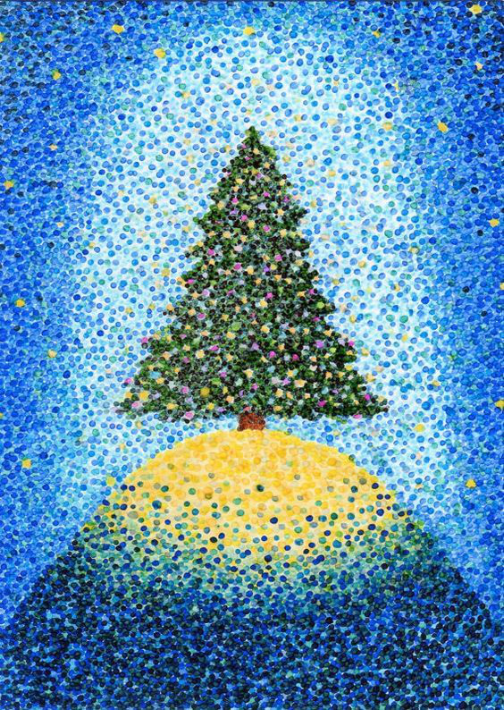
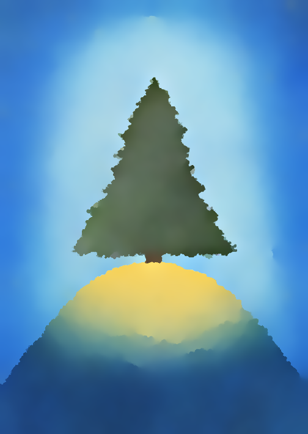
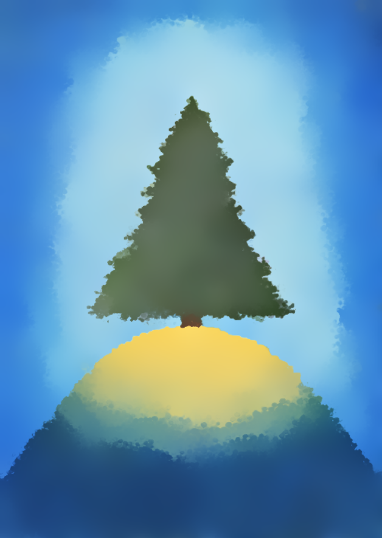

# Final Assignment for Visual Media (2024)

This is the Github page for the final assignment for Visual Media (2024).

The paper I chose to implement is: "Pyramid Texture Filtering".

[Qing Zhang, Hao Jiang, Yongwei Nie, and Wei-Shi Zheng. **Pyramid Texture Filtering**. ACM Transactions on Graphics (Proceedings of SIGGRAPH 2023).]

Github page: https://rewindl.github.io/pyramid_texture_filtering/
## Explanation
### What I have implemented
I implemented Pyramid Texture Filtering using Javascript. The result can be seen from the demo webpage below.

Demo Webpage: https://citrus0i.github.io/visualmedia24/

I implemented Gaussian filter, joint bilateral filter, etc., and constructed Gaussian and Laplacian pyramid structures.
I didn't use any library in this implementation.

### Why the paper is important
This paper proposes a new texture smoothing method called "pyramid texture filtering" which is very effective for the task of smoothing out textures while preserving the structure of the objects in an image.

Distinguishing texture from structure is a big challege for texture smoothing task because texture and structure are often very similar visually. 
Previous studies which proposed texture-structure separation methods, including learning-based methods, struggled with their generalization ability.

The fact that this method does not utilize any machine learning related algorithms, but only adopts some classical image processing techniques, 
while is still able to create extremely good results with extremely good generalization ability compared to other state-of-the-art methods, make it really interesting and inspiring.

## Sample result
Here is one example of the result of my implementation.

  
  
  

[Left]: Sample input image obtained from the original paper.

[Center]: Sample output image obtained from the original paper.

[Right]: Sample output image of my own implementation.

Note that I couldn't create exactly the same result using parameters provided in the paper. (Maybe there are some minor differences in the implementation.)
Typically using larger sigma space (2~3 times larger) can output similar results shown in the paper. The sample output image here used sigma space as 10 (5 in the original paper).
